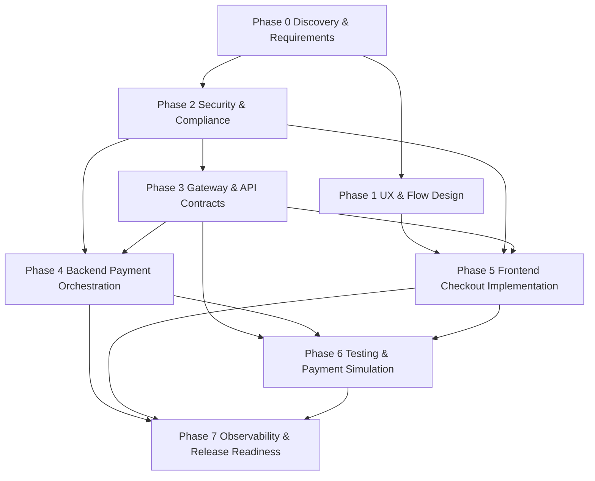
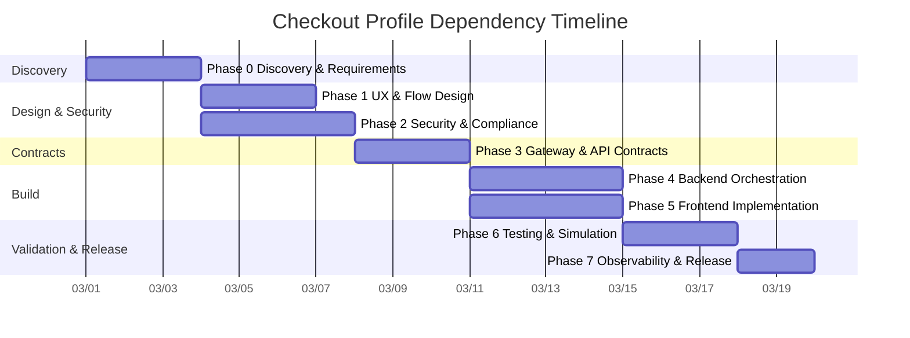

# Checkout Reference Simulation

This worked example demonstrates how a team executes the Payment Checkout profile end-to-end.

## 1) Create the main initiative issue

Create the initiative issue with checkout-specific context and template variables.

Example initiative payload:

- Initiative title: `Payment Checkout Rollout — Global Web Store`
- `{{PAYMENT_PROVIDER}}`: `Stripe`
- `{{SUPPORTED_PAYMENT_METHODS}}`: `Card, Apple Pay, Google Pay, Saved Card`
- `{{DEFAULT_CURRENCY}}`: `USD`
- `{{CHECKOUT_MODE}}`: `Embedded One-Page Checkout`
- `{{PCI_SCOPE}}`: `SAQ-A (tokenized card capture via hosted fields)`
- `{{FRAUD_PROVIDER}}`: `Radar`

Expected behavior:

- Main initiative issue is created
- Phase 0 issue is auto-created and linked to the initiative

## 2) Phase 0 auto-creation and good output quality

When Phase 0 (`discovery-and-requirements`) is auto-created, high-quality output should include:

- Explicit market and method coverage by payment method and currency
- Journey maps for guest, returning user, and recovery flows
- PCI boundary statement with clear data-handling responsibilities
- Lifecycle states for order and payment with terminal states
- Clear KPIs and acceptance criteria tied to observable outcomes

Abbreviated good output example:

- Payment methods: `Card, Apple Pay, Google Pay`
- Markets: `US, CA`
- Currencies: `USD, CAD` (default `USD`)
- Lifecycle states:
  - Order: `draft -> pending_payment -> confirmed | cancelled`
  - Payment: `initialized -> requires_action -> authorized -> captured | failed | cancelled`

## 3) Phase progression and parallel fan-out



Parallelization highlights:

- Phase 1 and Phase 2 can run in parallel after Phase 0
- Phase 4 and Phase 5 can run in parallel after contract and security prerequisites

## 4) Sample outputs from key phases (abbreviated)

### Discovery sample: payment methods

- Primary: `Card (Visa/Mastercard/Amex)`
- Wallet: `Apple Pay`, `Google Pay`
- Stored payment: `Saved card token` for returning users
- Fallback policy: wallet unavailable -> card form available in same session

### Backend sample: state machine

```text
Order: DRAFT -> PENDING_PAYMENT -> CONFIRMED
Order: DRAFT -> PENDING_PAYMENT -> CANCELLED

Payment: INITIALIZED -> REQUIRES_ACTION -> AUTHORIZED -> CAPTURED
Payment: INITIALIZED -> AUTHORIZED -> CAPTURED
Payment: * -> FAILED
Payment: AUTHORIZED -> REFUNDED (partial or full)
```

### Testing sample: scenario matrix excerpt

- `Card success`: order confirmed, payment captured
- `Card decline`: payment failed, order remains recoverable
- `Requires action (3DS)`: challenge required, resume flow validated
- `Gateway timeout`: pending state with eventual reconciliation
- `Webhook replay`: duplicate event ignored by deduplication store

### Observability sample: dashboard metrics

- Authorization success rate
- Checkout conversion rate
- Decline rate by BIN range and payment method
- Webhook processing latency (p50/p95)
- Duplicate event detection count
- Refund rate and refund failure rate

## 5) Edge cases explicitly covered

- Duplicate submission: same idempotency key returns prior result
- Webhook replay: repeated provider event does not double-transition state
- 3DS abandonment: timed-out requires-action state enters recovery path
- Provider timeout: synchronous uncertainty resolved by async reconciliation

## 6) Visual timeline



## Expected initiative completion signal

A successful execution path shows:

- All phase issues closed in dependency order
- Phase 6 includes verified simulations for success, failure, and abuse paths
- Phase 7 has active dashboards, alerts, and launch checklist approval
- Initiative tracking links all phase issues to `#{{ISSUE_NUMBER}}`
