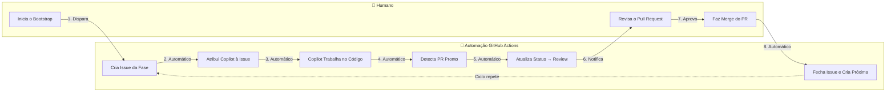
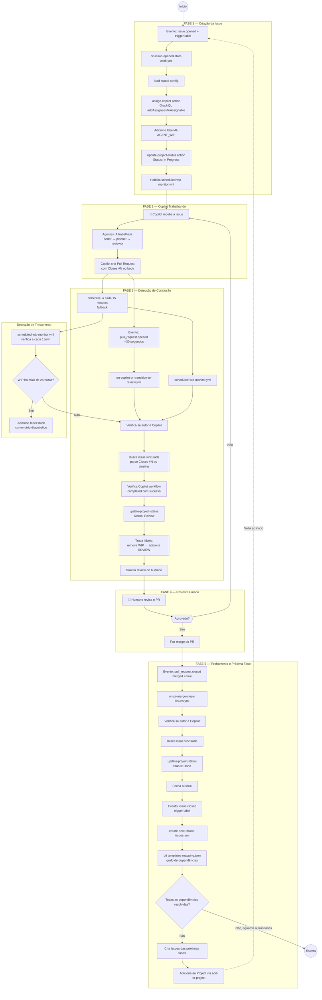
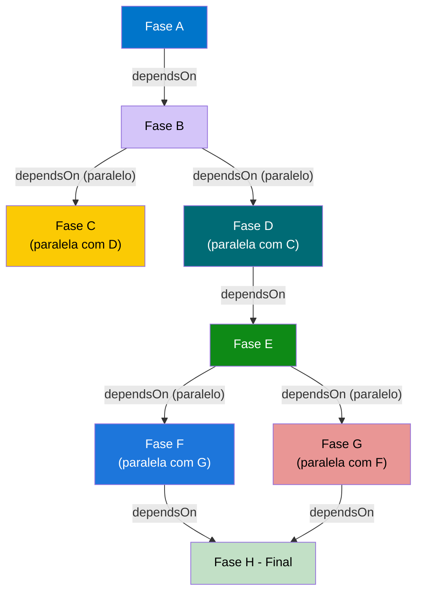
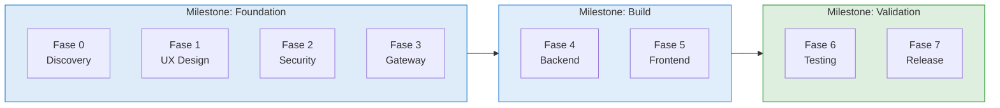
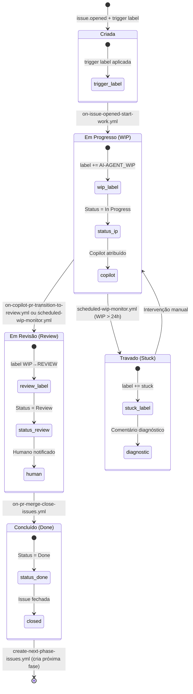
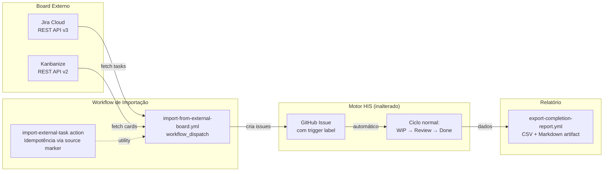

# Hybrid Intelligence Squad (HIS)

> Um framework de automação baseado em **GitHub Actions** e **GitHub Copilot** que organiza trabalho complexo em fases sequenciais, alternando entre execução autônoma por IA e revisão humana. O HIS orquestra o ciclo completo — da criação de tarefas até a entrega — com rastreabilidade total via GitHub Projects.

---

## 1. Visão Geral — Como Funciona

O HIS funciona como um **ciclo autônomo**: uma issue é criada, o Copilot trabalha nela, um humano revisa, e ao fazer merge a próxima fase é criada automaticamente.



---

## 2. Arquitetura de Componentes

Todos os arquivos vivem dentro de `.github/` e se dividem em **4 camadas**:

```mermaid
flowchart TB
    subgraph CONFIG["Camada de Configuração"]
        SC["squad-config.json<br/>Org, Projeto, Labels,<br/>Bot Login, Timeout"]
        TM["templates/default/templates-mapping.json<br/>Labels + Grafo de dependências das fases"]
        IT["templates/default/0N-*.md<br/>Templates de Issue por fase"]
    end

    subgraph ACTIONS["Camada de Ações Reutilizáveis"]
        LSC["load-squad-config<br/>Lê config → outputs"]
        AC["assign-copilot<br/>GraphQL: addAssignees"]
        CI["create-phase-issue<br/>REST: criar issue + sub-issue + projeto"]
        UPS["update-project-status<br/>GraphQL: update field"]
        FWI["find-wip-issues<br/>REST: busca paginada"]
        SL["sync-labels<br/>REST: sync labels"]
        SM["sync-milestones<br/>REST: sync milestones"]
        ATP["add-to-project<br/>GraphQL: add item"]
        IET["import-external-task<br/>REST: importar task individual"]
    end

    subgraph WORKFLOWS["Camada de Workflows"]
        W1["bootstrap-squad.yml<br/>Setup inicial manual"]
        W2["on-issue-opened-start-work.yml<br/>Issue aberta → WIP"]
        W3["on-copilot-pr-transition-to-review.yml<br/>PR aberto → Review"]
        W4["scheduled-wip-monitor.yml<br/>Monitor a cada 15min"]
        W5["on-pr-merge-close-issues.yml<br/>PR mergeado → Done"]
        W6["create-next-phase-issues.yml<br/>Issue fechada → próxima"]
        W7["manual-sync-labels.yml<br/>Sync manual de labels"]
        W8["import-from-external-board.yml<br/>Importar tasks Jira/Kanbanize"]
        W9["export-completion-report.yml<br/>Relatório CSV/Markdown"]
    end

    subgraph AGENTS["Camada de Agentes IA"]
        AG1["coder.agent.md<br/>Implementa código"]
        AG2["planner.agent.md<br/>Cria planos"]
        AG3["reviewer.agent.md<br/>Revisa qualidade"]
        AG4["orchestrator.agent.md<br/>Coordenação"]
    end

    SC --> LSC
    TM --> SL
    TM --> SM
    TM --> W6
    IT --> W6
    IT --> W1

    LSC --> W1 & W2 & W3 & W4 & W5 & W6 & W8
    AC --> W2
    CI --> W1 & W6
    UPS --> W2 & W3 & W4 & W5
    FWI --> W4
    SL --> W1 & W7
    SM --> W1 & W6
    ATP --> W6 & W8
    IET --> W8

    AG4 -.->|delega| AG1 & AG2 & AG3
```



---

## 3. Ciclo de Vida Completo de uma Issue

Este é o fluxo detalhado desde a criação até o fechamento de cada fase:



---

## 4. Grafo de Dependências das Fases

As fases são definidas em `templates-mapping.json` e seguem um grafo de dependências configurável. Fases paralelas são criadas simultaneamente quando suas dependências são atendidas.

> **Nota:** O diagrama abaixo ilustra o grafo do perfil `modernization` (8 fases). Outros perfis possuem grafos diferentes — `default` (4 fases), `feature` (3 fases), `bugfix` (2 fases). A estrutura é sempre configurável via `templates-mapping.json` do perfil ativo.



Cada fase é um objeto em `templates-mapping.json` com:
- **id**: identificador único da fase
- **dependsOn**: lista de fases que devem estar concluídas antes
- **parallelizable / canRunWith**: permite execução simultânea com outra fase
- **template**: arquivo `.md` com o corpo da issue

### Milestones (Opcional)

Perfis podem agrupar fases em **milestones** para organizar entregas no GitHub. Milestones são definidas no `templates-mapping.json` e sincronizadas automaticamente durante o bootstrap e criação de fases.



Cada template em `templates-mapping.json` pode incluir um campo `milestone` referenciando o título da milestone:

```json
{
    "milestones": [
        { "title": "Foundation", "description": "Fases 0-3", "state": "open" }
    ],
    "templates": [
        { "id": "discovery", "milestone": "Foundation", "..." }
    ]
}
```

Quando `milestones` não está presente, o framework funciona normalmente sem criar milestones - a feature é **totalmente opcional**.

---

## 5. Máquina de Estados — Labels e Status

Cada issue passa por estados bem definidos, controlados por labels e pelo campo "Status" no GitHub Project:



---

## 6. Mapa de Arquivos — Referência Rápida

```mermaid
flowchart LR
    subgraph ROOT[".github/"]
        direction TB

        subgraph CFG["Configuração"]
            F1["squad-config.json"]
        end

        subgraph TPL["Templates"]
            F3["templates/default/templates-mapping.json"]
            F4["templates/default/0N-*.md"]
        end

        subgraph ACT["Ações Reutilizáveis"]
            F5["actions/load-squad-config/"]
            F6["actions/assign-copilot/"]
            F7["actions/create-phase-issue/"]
            F8["actions/update-project-status/"]
            F9["actions/find-wip-issues/"]
            F10["actions/sync-labels/"]
            F10b["actions/sync-milestones/"]
            F11["actions/add-to-project/"]
            F20["actions/import-external-task/"]
        end

        subgraph WKF["Workflows"]
            F12["workflows/bootstrap-squad.yml<br/>Manual — setup inicial"]
            F13["workflows/on-issue-opened-start-work.yml<br/>issue.opened — atribui Copilot"]
            F14["workflows/on-copilot-pr-transition-to-review.yml<br/>pull_request — detecta PR"]
            F15["workflows/scheduled-wip-monitor.yml<br/>schedule 15min — fallback"]
            F16["workflows/on-pr-merge-close-issues.yml<br/>PR merged — fecha issue"]
            F17["workflows/create-next-phase-issues.yml<br/>issue.closed — próxima fase"]
            F18["workflows/manual-sync-labels.yml<br/>Manual — sync labels"]
            F21["workflows/import-from-external-board.yml<br/>Manual — importar Jira/Kanbanize"]
            F22b["workflows/export-completion-report.yml<br/>Manual — relatório"]
        end

        subgraph AGT["Agentes IA"]
            F19["agents/coder.agent.md<br/>Implementação"]
            F20["agents/planner.agent.md<br/>Planejamento"]
            F21["agents/reviewer.agent.md<br/>Revisão"]
            F22["agents/orchestrator.agent.md<br/>Orquestração"]
        end
    end

    F1 --> F5
    F5 --> F12 & F13 & F14 & F15 & F16 & F17
    F22 -.-> F19 & F20 & F21
```



---

## 7. Tabela de Eventos e Gatilhos

| Evento GitHub | Workflow Acionado | O que Acontece |
|---|---|---|
| `workflow_dispatch` | `bootstrap-squad.yml` | Setup inicial: cria config, labels, primeira fase |
| `issues.opened` + trigger label | `on-issue-opened-start-work.yml` | Atribui Copilot, WIP label, Status → In Progress |
| `pull_request.opened/sync/ready` | `on-copilot-pr-transition-to-review.yml` | Detecta PR do Copilot, Status → Review (~30s) |
| `schedule: */15` | `scheduled-wip-monitor.yml` | Fallback: monitora WIP, detecta stuck (>24h) |
| `pull_request.closed` (merged) | `on-pr-merge-close-issues.yml` | Status → Done, fecha issue vinculada |
| `issues.closed` + trigger label | `create-next-phase-issues.yml` | Resolve dependências, cria próximas fases |
| `workflow_dispatch` | `manual-sync-labels.yml` | Re-sincroniza labels do repositório |
| `workflow_dispatch` | `import-from-external-board.yml` | Importa tasks do Jira/Kanbanize como GitHub Issues |
| `workflow_dispatch` | `export-completion-report.yml` | Gera relatório CSV/Markdown de tarefas importadas |

---

## 8. Fluxo Completo — Exemplo Prático

> Cenário: Um projeto com 4 fases configuradas (A → B → C+D paralelas)

```
1. 👤 Humano executa "bootstrap-squad.yml" manualmente
   └─ Gera squad-config.json com org, projeto, labels
   └─ Sincroniza labels no repositório
   └─ Cria Issue da Fase A com trigger label + WIP label

2. 🤖 on-issue-opened-start-work.yml dispara (issue.opened)
   └─ Atribui copilot-swe-agent à issue
   └─ Status do Projeto → "In Progress"
   └─ Habilita scheduled-wip-monitor.yml

3. 🤖 Copilot trabalha na tarefa
   └─ Agentes IA: planner → coder → reviewer
   └─ Cria branch, implementa a entrega
   └─ Abre PR com "Closes #N" no body

4. 🤖 on-copilot-pr-transition-to-review.yml dispara (~30 segundos)
   └─ Detecta PR do Copilot vinculado à Issue
   └─ Status → "Review"
   └─ Labels: remove WIP, adiciona REVIEW
   └─ Solicita review do humano

5. 👤 Humano revisa e aprova o PR
   └─ Faz merge

6. 🤖 on-pr-merge-close-issues.yml dispara
   └─ Status → "Done"
   └─ Fecha a Issue

7. 🤖 create-next-phase-issues.yml dispara
   └─ Fase A fechada → dependência da Fase B resolvida
   └─ Cria Issue da Fase B

8. Ciclo repete do passo 2
   └─ Fase B fechada → Fase C + Fase D criadas (paralelo!)
   └─ Fase C + Fase D fechadas → Projeto Completo!
```

---

## 9. Integração com Boards Externos (Jira / Kanbanize)

O HIS suporta a importação de tarefas de boards externos via abordagem **Import & Replicate**: as tasks são copiadas para GitHub Issues e o framework processa automaticamente.



### Fluxo do PO

1. **Admin (uma vez)**: Configura secrets no repositório
   - Jira: `JIRA_EMAIL` + `JIRA_API_TOKEN`
   - Kanbanize: `KANBANIZE_API_KEY`
2. **PO**: Actions → **Import from External Board** → Run workflow
3. **Automático**: Fetch → Idempotência → Criar Issues → HIS processa
4. **PO**: Actions → **Export Completion Report** → Download artifact

### Idempotência

Cada issue importada contém um marcador invisível no body:
```html
<!-- source: jira:PROJ-123 -->
```
O workflow verifica todos os issues existentes antes de importar. Executar múltiplas vezes é seguro — tasks já importadas são ignoradas.

### Issues Importadas vs Issues de Fase

Issues importadas são **independentes** — não disparam encadeamento de fases (`create-next-phase-issues` ignora graciosamente). Seguem um ciclo único: WIP → Review → Done.

---

## 10. Autenticação — HIS_TOKEN (PAT Fine-Grained)

Os workflows do HIS definem `GH_TOKEN` no nível do job (`env: GH_TOKEN: ${{ secrets.HIS_TOKEN }}`). Esse ambiente é herdado por todos os steps, incluindo actions compostas locais e actions compostas aninhadas.

As actions compostas do HIS não recebem mais `token` como input. Steps que usam `gh` CLI consomem `GH_TOKEN` herdado automaticamente. Steps `actions/github-script` usam `github-token: ${{ env.GH_TOKEN }}`.

| Componente | Token | Configuração |
|---|---|---|
| Workflows (nível de job) | `GH_TOKEN` com valor de `secrets.HIS_TOKEN` | Configurar `HIS_TOKEN` uma vez por repositório |
| Actions compostas do HIS (gh CLI) | `GH_TOKEN` herdado do job | Nenhum repasse via `with` |
| Actions compostas / workflows (`actions/github-script`) | `github-token: ${{ env.GH_TOKEN }}` | Usa o token já definido no job |
| Jira import | `secrets.JIRA_EMAIL` + `secrets.JIRA_API_TOKEN` | Uma vez pelo admin |
| Kanbanize import | `secrets.KANBANIZE_API_KEY` | Uma vez pelo admin |

---

## 11. Glossário

| Termo | Significado |
|---|---|
| **Squad Config** | Arquivo JSON central com todas as configurações do projeto |
| **Composite Action** | Ação reutilizável do GitHub Actions (como uma função) |
| **Workflow** | Automação que executa em resposta a eventos do GitHub |
| **Copilot (agente)** | IA que implementa código automaticamente nas issues |
| **WIP** | "Work In Progress" — Copilot está trabalhando |
| **Review** | Copilot terminou, aguardando revisão humana |
| **Done** | PR aprovado e mergeado, fase concluída |
| **Stuck** | Copilot não completou em 24h — precisa de atenção |
| **Phase (Fase)** | Uma etapa do projeto, definida em templates-mapping.json |
| **Milestone** | Agrupamento opcional de fases em marcos de entrega no GitHub, sincronizados automaticamente via `sync-milestones` |
| **Templates Mapping** | Grafo que define a ordem e dependências entre fases |
| **GraphQL Mutation** | Chamada à API do GitHub para modificar dados (projeto, assignees) |
| **Idempotência** | Garantia de não duplicar ações se executadas múltiplas vezes |
| **Import & Replicate** | Abordagem de importar tasks de boards externos (Jira/Kanbanize) para GitHub Issues, sem alterar o motor do HIS |
| **Source Marker** | Comentário HTML invisível (`<!-- source: jira:PROJ-123 -->`) usado para idempotência na importação |
